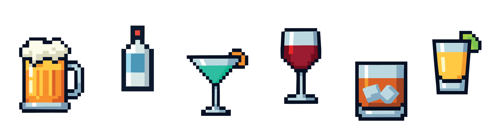
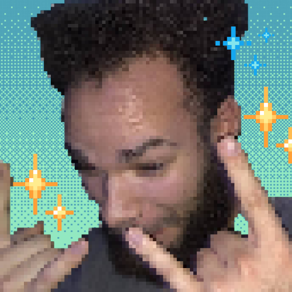
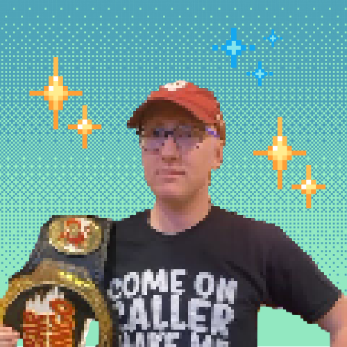
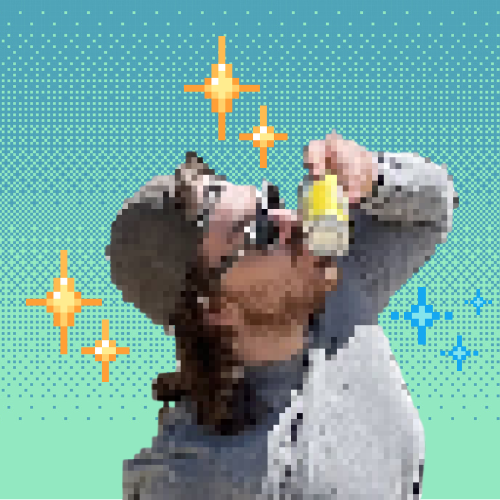
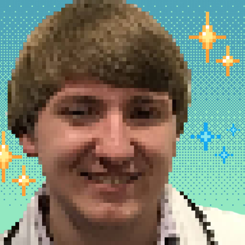
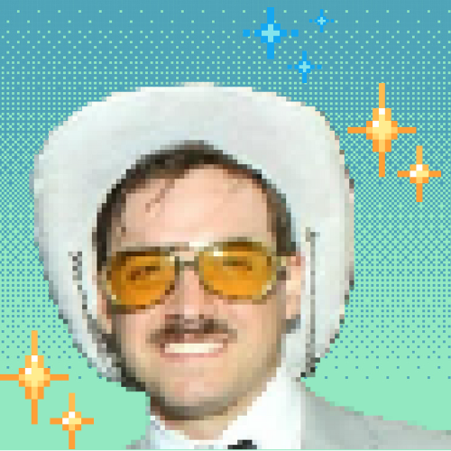
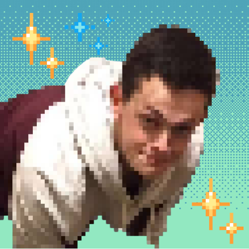
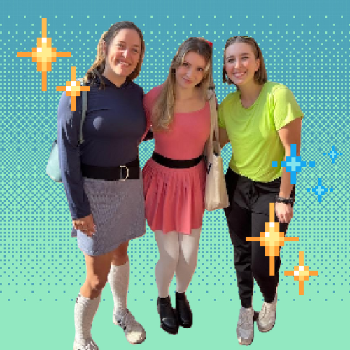

# Pub Golf 2025

The legendary bar crawl returns for its third year! Six competitors will battle against one another across 9 bars in Columbus. Who will claim victory and be crowned Pub Golf Champion?

  

## EVENT INFO

### Date & Time
November 22nd — 10:30 AM

### Meeting place
North Market in Downtown

### Theme
This year's theme will be based on classic Mario multiplayer games, like Mario Party and Mario Kart. We will have ample mini games & other Mario-related extras!

### Attire
Since we missed Halloween, this year we are going for comfort by choosing flannels as the themed attire.

## CHALLENGE DETAILS

We have decided to give some information on the event before it begins. We hope this helps you strategize ahead of time.

### Power Ups

At the start of the event, each player will be allowed to choose a Power Up. These Power Ups are all beneficial to the player in some way, and there are no limits to who can choose which Power Up (all players could choose the same Power Up, for example). The Power Up can be used once during any point in the challenge.

### Other Events

Each bar stop will consist of the following events:
<ol>
  <li>A Random Event will be chosen at the end of each bar</li>
  <li>A drink challenge of some variety will occur at each bar</li>
</ol>

### Random Events

Before each bar, every participant will draw a random event. These events range from helpful to mildly inconvenient to challenging. Each event has a different probability of occurring: green events are common, yellow events are uncommon, and red events are rare.

<ul>
  <li class="event-common">Banana — Stand on one leg and finish your next drink without support (+1 if you fail)</li>
  <li class="event-common">Ice flower — Drink a glass of ice water at the next bar in addition to your assigned drink</li>
  <li class="event-common">Blooper — Bartender picks your next drink instead of the assigned one</li>
  <li class="event-uncommon">Poison mushroom — Breathalyze and guess your BAC; take a shot if the guess is off by a certain percentage</li>
  <li class="event-uncommon">Boo — Steal someone else's random event and discard your own; that person redraws</li>
  <li class="event-uncommon">Ba-bomb — A referee takes half of your drink</li>
  <li class="event-uncommon">Green shell — Pick a player to chug the next assigned drink; if not, the group chooses a random shot the player must take</li>
  <li class="event-rare">Lightning — Everyone except you takes a shot chosen by the ref</li>
  <li class="event-rare">Red shell — Challenge another player to quarters; loser takes a shot</li>
</ul>

## ROUTE

  

    <iframe src="https://www.google.com/maps/d/u/0/embed?mid=1Yu5gbDdEx6HgdIWQ4XP41qB8fNG_1Ec&ehbc=2E312F&noprof=1" width="640" height="480"></iframe>
  

  
  

    <h3>The Bars</h3>
    
* Indicates a location we will be eating at

    <ol>
      <li>North Market Downtown*</li>
      <li>R Bar Arena</li>
      <li>Brothers Bar & Grill</li>
      <li>Fanatics Sportsbook Columbus</li>
      <li>Mikey's Late Night Slice*</li>
      <li>Novak's Tavern & Patio</li>
      <li>Taproom at Wolf's Ridge Brewing</li>
      <li>Jackie O's On Fourth</li>
      <li>Pins Mechanical Co.</li>
    </ol>
  

## CHOOSE YOUR FIGHTER

  <figure class="participant-card">
    
    <figcaption>
      Brendon
    </figcaption>
  </figure>

  <figure class="participant-card">
    
    <figcaption>
      Collin
    </figcaption>
  </figure>

  <figure class="participant-card">
    
    <figcaption>
      Jason
    </figcaption>
  </figure>

  <figure class="participant-card">
    
    <figcaption>
      Nick
    </figcaption>
  </figure>

  <figure class="participant-card">
    
    <figcaption>
      Sandy
    </figcaption>
  </figure>

  <figure class="participant-card">
    
    <figcaption>
      Spencer
    </figcaption>
  </figure>

## KNOW YOUR REFS

<figure class="participant-card">
  
  <figcaption>
    Kristin, Maddie & Alivia
    What we say goes! Do not question your refs!
  </figcaption>
</figure>

